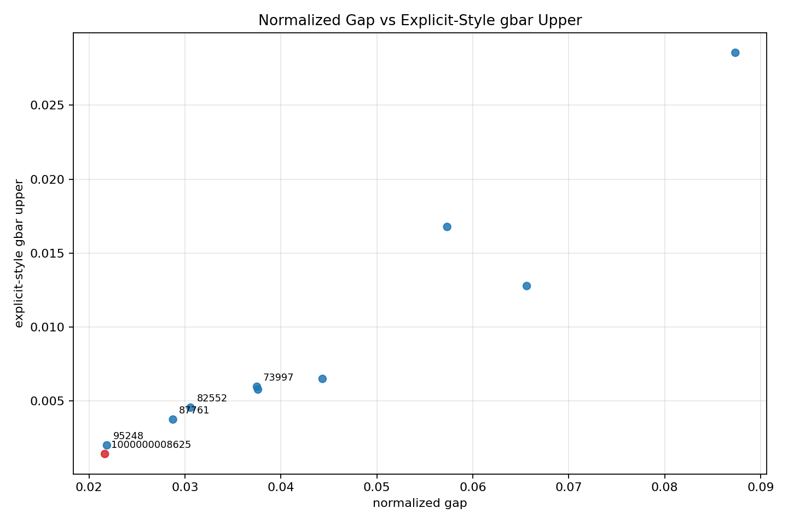

# Riemann de Bruijn Lab

**A claim-safe computational workbench for zeta zeros, Lehmer pairs, and local
de Bruijn-Newman diagnostics.**


Riemann de Bruijn Lab is a reproducible Python repository for finite numerical
experiments around Riemann zeta zeros, unusually small zero gaps, Lehmer-style
diagnostics, explicit-style tail estimates, and local de Bruijn-Newman flow
models.

The repository is built for skeptical readers: every public result should be
reproducible, every dataset should have provenance, and every mathematical
claim should be labeled by strength.

## Navigation

- For developers: start with [Quickstart](#quickstart), the `riemann-lab` CLI,
  and the tests under `tests/`.
- For mathematically curious readers: start with
  [Research Contract](#research-contract), [Current Finite Candidate Summary](#current-finite-candidate-summary),
  and [docs/current_results.md](docs/current_results.md).
- For reviewers: start with [REPRODUCIBILITY.md](REPRODUCIBILITY.md),
  [docs/limitations.md](docs/limitations.md), and the claim labels used in
  generated reports.

## Research Contract

This lab is intentionally conservative about mathematical language.

- It does not prove the Riemann Hypothesis.
- It does not establish `Lambda <= 0`.
- Finite-flow and gap-energy experiments are heuristic diagnostics.
- Explicit-style tail estimates are conditional on stated assumptions.
- Large historical artifacts are not treated as canonical source truth.

## Why This Matters

The de Bruijn-Newman program turns the Riemann Hypothesis into a question about
how zeros move under a heat-flow deformation. Extreme Lehmer pairs and very
small normalized gaps are natural stress tests for that picture.

This repository does not try to turn finite computation into a theorem. Its
purpose is narrower and useful: make the computations inspectable, separate
source data from derived metrics, preserve precision warnings, and provide a
clean Python surface for comparing candidates without overstating what the
numbers mean.

For open-source reviewers, the project is a small packaged Python codebase with
tests, a CLI, reproducibility docs, curated data, generated reports, and a
claim-language checker. For public readers, it is a disciplined example of how
to publish RH-adjacent numerical work without overstated proof language.

## Output Preview



The plotted comparison is a finite diagnostic view over the currently available
candidate rows. It is not evidence of a proof.

## What This Repository Contains

- `riemann_lab`, a Python package for zero-table loading, gap analysis,
  Lehmer-style diagnostics, finite scans, local flow experiments, and reports.
- `riemann-lab`, a CLI for reproducible experiments.
- Curated processed data for candidate comparison.
- Public result summaries under `outputs/`.
- A claim-language checker that fails on dangerous public phrasing.
- Issue templates for reproducibility problems and mathematical claim review.

## Claim Labels

Public reports use explicit claim-strength labels:

- `FACT_FROM_SOURCE_DATA`
- `NUMERICAL_COMPUTATION`
- `HEURISTIC_ESTIMATE`
- `EXPLICIT_STYLE_BOUND`
- `CONDITIONAL_STATEMENT`
- `OPEN_PROBLEM`

These labels are part of the repository's quality bar, not decoration.

## Quickstart

```bash
python -m pip install -e ".[dev]"
python -m pytest
python -m ruff check .
python scripts/check_claim_language.py
```

On PowerShell, use the same commands.

## Clone-Safe Reproduction

This command uses committed curated CSVs and should work from a clean clone
after installation:

```bash
riemann-lab compare-candidates --out outputs/candidate_comparison
```

Historical reproduction scripts under `scripts/reproduce_*.py` may require
local artifacts under `artifacts/unpacked/`. Those large and duplicated
historical packages are intentionally ignored by Git and can be distributed as
release assets or restored from documented sources.

Some release assets and copied historical source reports use legacy
`cert`/`certificate` wording in filenames or text. Treat that as historical
artifact naming. Current public claims are governed by the claim-strength labels
and disclaimers in this repository, not by legacy package names.

## Example CLI Commands

Robin and Lagarias finite scan:

```bash
riemann-lab robin-scan --N 1000000 --out outputs/robin_1M
```

Candidate comparison from committed curated data:

```bash
riemann-lab compare-candidates --out outputs/candidate_comparison
```

Lehmer scan from a restored historical all-gaps artifact:

```bash
riemann-lab lehmer-scan \
  --zeros artifacts/unpacked/zeta_gap_collision_r80_package/zeta_gap_collision_r80_all_gaps.csv \
  --dataset around_1e12 \
  --radius 80 \
  --out outputs/lehmer_1e12
```

Explicit-style tail estimate from a restored historical all-gaps artifact:

```bash
riemann-lab certify-tail \
  --zeros artifacts/unpacked/zeta_gap_collision_r80_package/zeta_gap_collision_r80_all_gaps.csv \
  --dataset around_1e12 \
  --candidate 1000000008625 \
  --radius 80 \
  --out outputs/cert_1e12
```

## Current Finite Candidate Summary

Within the committed public summaries and local historical artifacts:

- Candidate A: `1000000008625 / 1000000008626`, around zero index `10^12`.
- Delta: approximately `0.0055569683`.
- Normalized gap: approximately `0.021646226566`.
- Explicit-style `gbar_upper`: approximately `0.0014258627`.
- Candidate A is strongest by normalized gap and explicit-style `gbar_upper`
  among the available comparison rows.
- The `around_1e21` pair
  `1000000000000000001635 / 1000000000000000001636` ranks strongest by the
  finite-flow near-collision diagnostic, with a stronger source-precision
  caution.

These are finite computational findings. They do not prove RH and do not
establish `Lambda <= 0`.

## Repository Map

- `src/riemann_lab/`: package code.
- `tests/`: regression tests for loaders, numerical routines, reports, and
  claim language.
- `scripts/`: reproducibility and report-building entry points.
- `docs/`: mathematical background, limitations, provenance, roadmap, and
  release checklists.
- `data/processed/`: small curated processed data committed for clean-clone
  workflows.
- `outputs/`: intentionally published result summaries, tables, and plots.
- `artifacts/`: local historical packages and unpacked generated artifacts;
  ignored by Git unless intentionally published elsewhere.

## Quality Gates

Before publishing changes:

```bash
python -m pytest
python -m compileall -q src scripts tests
python -m ruff check .
python scripts/check_claim_language.py
riemann-lab compare-candidates
```

These checks are intentionally short enough to run locally before each public
update.

## Limitations

- Finite scans do not prove infinite statements.
- Explicit-style tail estimates depend on zero-count envelopes, endpoint
  policies, source precision, and implementation details.
- The `around_1e21` block is precision-sensitive.
- Finite local zero-flow is not the full `H_t` flow.
- Gap energies are exploratory diagnostics, not established global
  inequalities.

See [docs/limitations.md](docs/limitations.md) and
[REPRODUCIBILITY.md](REPRODUCIBILITY.md) for the full caveat set.

## References

- Clay Mathematics Institute:
  [Riemann Hypothesis](https://www.claymath.org/riemann/).
- A. M. Odlyzko:
  [Tables of zeros of the Riemann zeta function](http://www.dtc.umn.edu/~odlyzko/zeta_tables/).
- Brad Rodgers and Terence Tao:
  [The de Bruijn-Newman constant is non-negative](https://arxiv.org/abs/1801.05914).
- D. H. J. Polymath:
  [Effective approximation of heat flow evolution of the Riemann xi function,
  and a new upper bound for the de Bruijn-Newman constant](https://arxiv.org/abs/1904.12438).
- Timothy S. Trudgian:
  [An improved upper bound for the argument of the Riemann zeta-function on
  the critical line II](https://arxiv.org/abs/1208.5846).
- George Csordas, Wayne Smith, and Richard S. Varga:
  [Lehmer pairs of zeros, the de Bruijn-Newman constant, and the Riemann
  Hypothesis](https://www.math.kent.edu/~varga/pub/paper_206.pdf).
- Guy Robin:
  [Grandes valeurs de la fonction somme des diviseurs et hypothese de Riemann](https://zbmath.org/0556.10025);
  see also
  [On Robin's criterion for the Riemann Hypothesis](https://arxiv.org/abs/math/0604314).
- Jeffrey C. Lagarias:
  [An Elementary Problem Equivalent to the Riemann Hypothesis](https://arxiv.org/abs/math/0008177).

## Citation

If you use this repository, cite the repository and separately cite the primary
mathematical and data sources you rely on. See [CITATION.cff](CITATION.cff).

## License

MIT. See [LICENSE](LICENSE).
